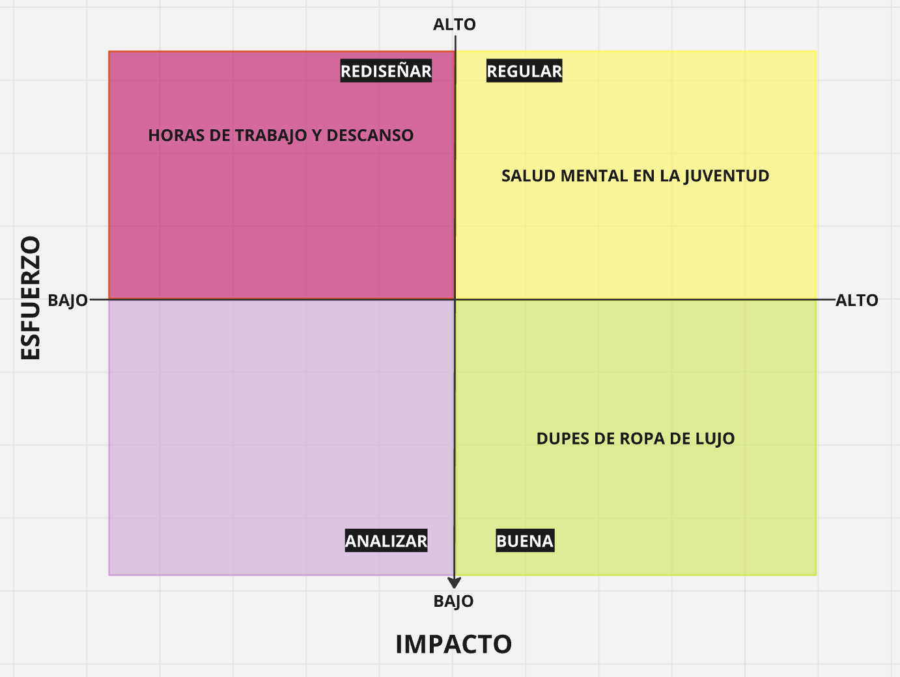

# Tarea 01 - Propuesta de temas
## Daniel Gaete 

1. Salud Mental en la juventud

Realizar un análisis comparativo de las tasas de suicidio juvenil en diferentes países de Latinoamérica, con el objetivo de identificar cuál es el más afectado por esta problemática y examinar las características políticas, económicas y sociales que podrían influir en estas cifras.

2. Horas de trabajo y descanso

Demostrar, a través de la evolución de datos, cómo ha evolucionado la rutina laboral del trabajador promedio, explorando las transformaciones en variaciones en el tiempo dedicado al ocio y la productividad. Se profundizará en los impactos que ha tenido la reducción de la jornada laboral a 40 horas y cómo estos cambios han moldeado la vida cotidiana y el bienestar de los trabajadores.

3. Dupes de ropa de lujo

Explorar el mercado de las imitaciones de prendas de lujo y desentrañar su impacto en la industria de la moda, considerando tanto sus efectos económicos como el modo en que estas falsificaciones democratizan el acceso a artículos de alta gama para un público más amplio.

Para obtener una visión más clara de las oportunidades y desafíos asociados a cada idea, hemos desarrollado una matriz de impacto versus esfuerzo en la plataforma Miró.

 
[Aquí está el enlace de Miró](https://miro.com/app/board/uXjVKnFUQfU=/)

[def]: https://www.google.com/url?sa=i&url=https%3A%2F%2Fwww.istockphoto.com%2Fes%2Ffotos%2Fsalud-mental&psig=AOvVaw1g8WkFdt_7OJoerJV_M-Tt&ust=1724442028402000&source=images&cd=vfe&opi=89978449&ved=0CBEQjRxqFwoTCPCf96WtiYgDFQAAAAAdAAAAABAE